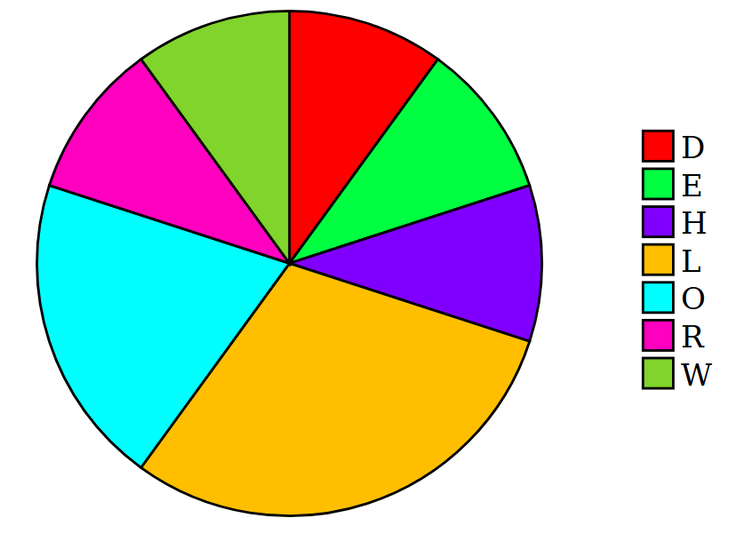

# brycharts

A Brython package for the creation of statistical charts (pie charts, histograms) etc).

### Hello World

All software should have a Hello World example. ;-)

Here is a minimalist html+Brython file to show the frequency of the letters in HELLOWORLD as a pie chart:

```html
<html>
  <head>
    <script src="https://cdn.jsdelivr.net/npm/brython@3.9.2/brython.min.js"></script>
    <script src="https://cdn.jsdelivr.net/npm/brython@3.9.2/brython_stdlib.js"></script>
    <script src="https://cdn.jsdelivr.net/gh/andy31lewis/brycharts@latest/brycharts.brython.js"></script>
    <script type="text/python">
from browser import document
import brycharts
freqdata = brycharts.FrequencyData(rawdata=list("HELLOWORLD"))
brycharts.PieChart(document, freqdata)
    </script>
  </head>
  <body id="body" onLoad="brython()">
  </body>
</html>
```

And here is the result:



This example can be seen at http://mathsanswers.org.uk/oddments/brycharts/helloworld.html

For many more examples, with details of how they were created, see  
http://mathsanswers.org.uk/oddments/brycharts/demo.html

## Charts and Data Structures

In order to display our data graphically, we first need to gather it into a suitable data structure. The following table lists the types of chart available (using their class names), and the data structures which can be used as input for each type of chart.

| **Type of chart**         | **Suitable data structure(s)**                               |
| ------------------------- | ------------------------------------------------------------ |
| PieChart                  | LabelledData, FrequencyData                                  |
| BarChart                  | LabelledData, FrequencyData                                  |
| StackedBarChart           | LabelledDataDict, FrequencyDataDict                          |
| GroupedBarChart           | LabelledDataDict, FrequencyDataDict                          |
| ScatterGraph              | PairedData, LabelledPairedData                               |
| LineGraph                 | PairedData, PairedDataDict, *TimeSeriesData*, *TimeSeriesDataDict* |
| BoxPlotCanvas             | BoxPlotData, BoxPlotDataDict                                 |
| Histogram                 | GroupedFrequencyData                                         |
| CumulativeFrequencyGraph  | CumulativeFrequencyData, CumulativeFequencyDataDict          |
| CumulativePercentageGraph | CumulativeFrequencyData, CumulativeFequencyDataDict          |

## Data Structures

This section lists the data structure classes, with the possible parameters to feed data into the class.

**`LabelledData(data, valueslabel)`**  
The parameters are:  
 `data`: a dictionary in which the values are numerical - eg `{"Bed":600, "Wardrobe":300, "Dressing Table":200}`

`valuelabel`: a description of the values (including the units where appropriate), eg `"Cost in £"` - this would be used, for example, as the axis label on a bar chart.

**`LabelledDataDict(datadict, valueslabel)`**  
The parameters are:  
 `datadict`: a dictionary in which the values are dictionaries of the form required for `LabelledData` above - eg
`{"Bedroom 1": {"Bed":600, "Wardrobe":300, "Dressing Table":200},`  
` "Bedroom 2": {"Bed":500, "Wardrobe":250, "Mirror":40} }`

`valuelabel`: a description of the values (including the units where appropriate), eg `"Cost in £"` - this would be used, for example, as the axis label on a bar chart.


**`FrequencyData(data=None, rawdata=None, valueslabel="Frequency")`**  
This is a subclass of `LabelledData` in which the values are frequencies.  The parameters are:

**either**
`data`: a dictionary in which the values are frequencies - eg `{"Cat":27, "Dog":45, "Rabbit":15}`  
**or**  
`rawdata`: a list of items to be counted - eg `["Cat", "Dog", "Cat", "Cat", "Rabbit", ...]`

`valueslabel`: description of the frequencies eg `"Number of pets"` - by default this is `"Frequency"`.

**`FrequencyDataDict(datadict=None, rawdatadict=None, valueslabel="Frequency")`**  
This is a subclass of `LabelledDataDict` in which the values are dictionaries of the form required for `FrequencyData` above.  The parameters are:

**either**  
`datadict`: a dictionary of dictionaries, eg  
`{"Village 1": {"Cat":27, "Dog":45, "Rabbit":15},`  
`"Village 2": {"Cat":16, "Dog":21, "Hamster":6} }`  
**or**  
`rawdatadict`: a dictionary of lists, eg  
`{"Village 1": ["Cat", "Dog", "Cat", "Cat", "Rabbit", ...],`  
`"Village 2": ["Cat", "Hamster", "Cat", "Dog", "Dog", ...] }`  

`valueslabel`: description of the frequencies eg `"Number of pets"` - by default this is `"Frequency"`.


**`PairedData(xlabel, ylabel, data)`**  
A list of data points (x, y).  Parameters:  
`xlabel`: description of the x-values eg `"Height (cm)"`  
`ylabel`:description of the y-values eg `"Weight (kg)"`  
`data`: a list eg `[(167, 74), (174, 82), (143, 57), ...]`

**`PairedDataDict(xlabel, ylabel, data)`**  
A dictionary of lists of data points. Parameters:  
`xlabel`: description of the x-values eg `"Height (cm)"`  
`ylabel`:description of the y-values eg `"Weight (kg)"`  
`datadict`:  eg `{"Boys": [(167, 74), (174, 82), ...], "Girls": [(157, 62), (143, 57), ...] }`


**`LabelledPairedData(xlabel, ylabel, data)`**  
A dictionary of labelled data points (x, y).  Parameters:  
`xlabel`: description of the x-values eg `"Height (cm)"`  
`ylabel`:description of the y-values eg `"Weight (kg)"`  
`data`: a dictionary eg `{"John":(167, 74), "Andy":(174, 82), "Anna":(143, 57), ...}`

**`LabelledPairedDataDict(xlabel, ylabel, data)`**  
A dictionary of dictionaries of labelled data points. Parameters:  
`xlabel`: description of the x-values eg `"Height (cm)"`  
`ylabel`:description of the y-values eg `"Weight (kg)"`  
`datadict`:  eg `{"Boys": {"John":(167, 74), "Andy":(174, 82), ...}, "Girls": {"Jane":(157, 62), "Anna":(143, 57), ...} }`


**`BoxPlotData(valueslabel, boxplotdata=None, rawdata=None)`**  
Data needed for drawing a box plot.  Parameters:
`valueslabel`: description of the data values, eg `"Height (cm)"`

**either**  
`boxplotdata`: list of 5 values `[min, Q1, Q2, Q3, max]` where `Qn` are the quartiles  
**or**  
`rawdata`: list of data values eg `[173, 187, 153, 164, ...]`

**`BoxPlotDataDict(valueslabel, boxplotdatadict=None, rawdatadict=None)`**  
Dictionary where the values are the data needed for drawing a box plot.  Parameters:
`valueslabel`: description of the data values, eg `"Height (cm)"`

**either**  
`boxplotdatadict`: dictionary of lists of 5 values as above eg  
`{"Boys": [min, Q1, Q2, Q3, max], "Girls": [min, Q1, Q2, Q3, max]}`  
**or**  
`rawdatadict`: dictionary of lists of data values eg  
`{"Boys": [173, 187, 183, 169, ...], "Girls": [163, 157, 153, 164, ...]}`


**`GroupedFrequencyData(valueslabel, data=None, rawdata=None, boundaries=None, classwidth=None)`**  
A list of classes and frequencies.  Parameters:  
`valueslabel`: description of the data values, eg `"Height (cm)"`

**either**  
`data`: A list of tuples `(lower class boundary, frequency)`. The final tuple should have a frequency of zero in order to provide the upper class boundary of the last class; if this is not present, a sensible upper class boundary will be appended to the data.  
**or**  
`rawdata`: A list of data values to be placed into classes and counted.  If `boundaries` is provided, it should be a list of class boundaries which encompass the data; otherwise an extra lower or upper boundary will be added if needed.  If `boundaries` is not provided, but `classwidth` is provided, then a set of classes of width `classwidth` will be generated.  If neither `boundaries` nor `classwidth` is provided, a suitable classwidth will be calculated based on the range of the data.

**`GroupedFrequencyDataDict(valueslabel, datadict=None, rawdatadict=None, boundaries=None, classwidth=None)`**  
Dictionary where the values are GroupedFrequencyData objects (see above).  Parameters:  
  `valueslabel`: description of the data values, eg `"Height (cm)"`

**either**  
`datadict`: A dictionary where the values are list of tuples `(lower class boundaries, frequency)`.  See above for more details.  
**or**  
`rawdatadict`: A dictionary where the values are lists of data values to be placed into classes and counted. See above for the use of the parameters `boundaries` and `classwidth`. If it is desired that all data sets should use the same class boundaries, be sure to provide the `boundaries` parameter and make sure that the lower and upper boundary encompass the data in every data set.


**`CumulativeFrequencyData(valueslabel, cumfreqdata=None, groupedfreqdata=None, rawdata=None, boundaries=None, classwidth=None)`**  
A list of upper class boundaries and cumulative frequencies.  Parameters:  
  `valueslabel`: description of the data values, eg `"Height (cm)"`

**either**  
`cumfreqdata`: A list of tuples `(upper class boundary, cumulativefrequency)`. The first tuple should have a frequency of zero in order to provide the lower class boundary of the first class; if this is not present, a sensible lower class boundary will be placed at the beginning of the data.  
**or**  
`groupedfreqdata`: A `GroupedFrequencyData` object (see above), *or* a list of tuples `(lower class boundary, frequency)`. The final tuple should have a frequency of zero in order to provide the upper class boundary of the last class; if this is not present, a sensible upper class boundary will be appended to the data.  
**or**  
`rawdata`: A list of data values to be placed into classes and counted.  See under `GroupedFrequencyData` for the use of  the parameters `boundaries` and `classwidth`.

**`CumulativeFrequencyDataDict(valueslabel, cfdatadict=None, rawdatadict=None, boundaries=None, classwidth=None)`**  
Dictionary where the values are `CumulativeFrequencyData` objects (see above).  Parameters:  
  `valueslabel`: description of the data values, eg `"Height (cm)"`

**either**  
`cfdatadict`: A dictionary where the values are list of tuples `(upper class boundary, frequency)`.  See above for more details.  
**or**  
 `gfdatadict`: A dictionary where the values are list of tuples `(lower class boundaries, frequency)`.  See above under `GroupedFrequencyData` for more details.  
**or**  
`rawdatadict`: A dictionary where the values are lists of data values to be placed into classes and counted. See above under `GroupedFrequencyData` for the use of the parameters `boundaries` and `classwidth`. If it is desired that all data sets should use the same class boundaries, be sure to provide the `boundaries` parameter and make sure that the lower and upper boundary encompass the data in every data set.


## Types of Chart

### Common Parameters

All the charts share some common parameters, as follows:

`parent`: The element in the document into which the chart should be placed.  
`data`: One of the data structures listed above, which will be used to draw the chart.  
`title`: (optional) A title to appear above the chart  
`fontsize`: Font size for labels, keys and tooltips.  
`width`: (optional) CSS width of the chart. Default is `"95%"`.  
`height`: (optional) CSS height of the chart. Default is `"95%"`.  
`objid`: (optional) HTML `id` for the chart.  


**`PieChart(parent, data, title="", colours=None, usekey=True, fontsize=14, width="95%", height="95%", objid=None)`**

Parameters:  
`data`: Either a `LabelledData` or a `FrequencyData` object.  
`colours`: A list of CSS colours to be used for the sectors of the pie chart.  If not given, a set of default colours will be used.  
`usekey`: If `True` (the default), the label for each colour will be shown as a key to the right of the chart.  If `False`, the labels will be shown around the edge of the pie chart. (In this case, the order of the sectors will be changed to avoid labels being superimposed.)

(For details of the other parameters, see **Common Parameters** above.)


**`BarChart(parent, data, title="", colour="yellow", fontsize=14, width="95%", height="95%", objid=None)`**

Parameters:  
`data`: Either a `LabelledData` or a `FrequencyData` object.  
`colour`: A  CSS colour to be used for the bar chart.  The default is `"yellow"`.  

(For details of the other parameters, see **Common Parameters** above.)

**`StackedBarChart(parent, data, title="", colours=None, fontsize=14, width="95%", height="95%", objid=None)`**

Parameters:  
`data`: Either a `LabelledDataDict` or a `FrequencyDataDict` object.  
`colours`: A list of CSS colours to be used for the sections of each bar.  If not given, a set of default colours will be used.

(For details of the other parameters, see **Common Parameters** above.)

**`GroupedBarChart(parent, data, title="", colours=None, fontsize=14, width="95%", height="95%", objid=None)`**

Parameters:  
`data`: Either a `LabelledDataDict` or a `FrequencyDataDict` object.  
`colours`: A list of CSS colours to be used for the bars within each group.  If not given, a set of default colours will be used.

(For details of the other parameters, see **Common Parameters** above.)


**`ScatterGraph(parent, data, title="", colour="red", showRegressionLine=False, fontsize=14, width="95%", height="95%", objid=None)`**

Parameters:  
`data`: Either a `PairedData` or a `LabelledPairedData` object.  
`colours`: A CSS colour for the points on the graph.  The default is `"red"`.  
`showregressionline`: If `True`, the (linear) regression line of y on x will be shown.  Its equation is shown in its tooltip, along with the Product moment Correlation Coefficient (PMCC) for the data.

(For details of the other parameters, see **Common Parameters** above.)


**`LineGraph(parent, data, title="", colours=None, fontsize=14, width="95%", height="95%", objid=None)`**

Parameters:  
`data`: Either a `PairedData` or a `PairedDataDict` object.  
`colours`: A list of CSS colours to be used for lines on the graph.  If not given, a set of default colours will be used.

(For details of the other parameters, see **Common Parameters** above.)


**`BoxPlotCanvas(parent, data, title="", colour="yellow", fontsize=14, width="95%", height="95%", objid=None)`**

Parameters:  
`data`: Either a `BoxPlotData` or a `BoxPlotDataDict` object.  
`colour`: A CSS colour for the boxes of the box plots.

(For details of the other parameters, see **Common Parameters** above.)


**`Histogram(parent, data, title="", colour="yellow", fontsize=14, width="95%", height="95%", objid=None)`**

Parameters:  
`data`: A `GroupedFrequencyData` object.  
`colour`: A CSS colour for the bars of the histogram.

(For details of the other parameters, see **Common Parameters** above.)


**`CumulativeFrequencyGraph(parent, data, title="", colours=None, fontsize=14, width="95%", height="95%", objid=None)`**

**`CumulativePercentageGraph(parent, data, title="", colours=None, fontsize=14, width="95%", height="95%", objid=None)`**

Parameters:  
`data`: Either a `CumlativeFrequencyData` or a `CumlativeFrequencyDataDict` object.  
`colours`: A list of CSS colours to be used for lines on the graph.  If not given, a set of default colours will be used.

(For details of the other parameters, see **Common Parameters** above.)


`valuelabel`: a description of the values (which should include the units), eg `"Cost in £"` - this would be used, for example, as the axis label on a bar chart.